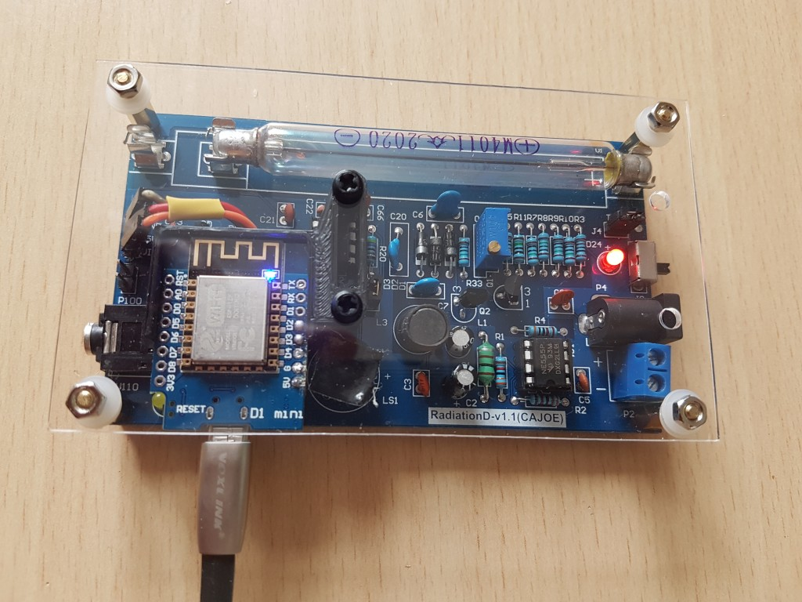
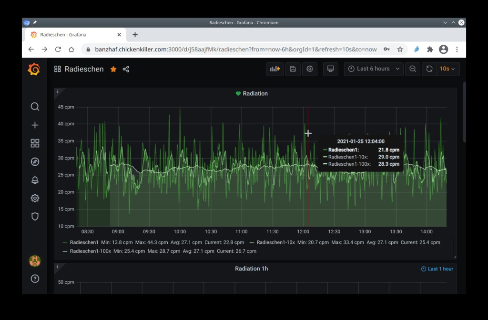

# Radieschen

Firmware for an ESP8266 to count radiation events with a geiger-müller-counter and post it to an InfluxDB database

Inspired by [Andreas Spiess](https://www.youtube.com/watch?v=K28Az3-gV7E). Part cost for me was <30€ (ESP8266 D1mini, RadiationD board, USB cable) 

## Hardware
Connect RadiationD-v1.1 (CAJOE) header 
| P3  | ESP |
|-----|-----|
| Gnd | Gnd |
| 5V  | 5V  |
| Vin | D2  |

Note: P3-Vin has 3.3V level on my board. Ideal for ESP8266, no level shifter needed. Strange pin name, but it really is the interrupt line (falling edge).

STL file for 3D-printing the D1mini mount (and already generated GCode for my Anycubic Kossel Pulley) is in the data/ subdirectory.

## Database
Won't go into detail on how to install InfluxDB or Grafana, but 
connect to InfluxDB is easy: modify influx server and port in platformio.ini and create the database on the server:

    job4:~ > influx
    Connected to http://localhost:8086 version 1.8.0
    InfluxDB shell version: 1.8.0
    > create database Radieschen

The grafana dashboard (JSON export) is also in the data directory.

